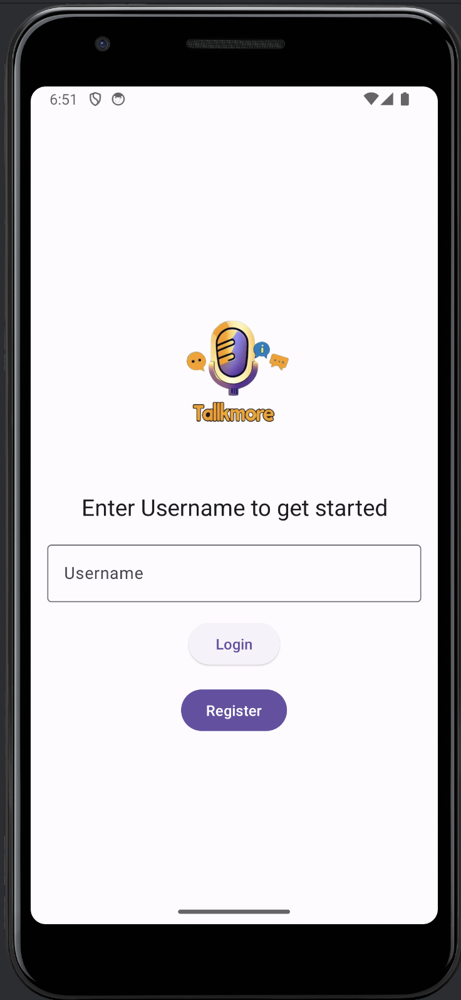
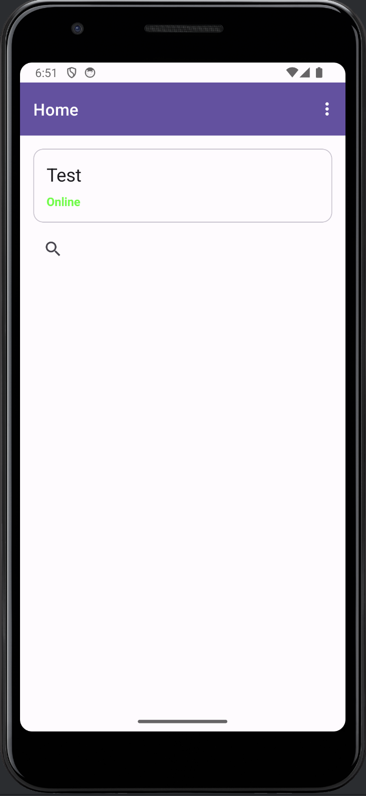
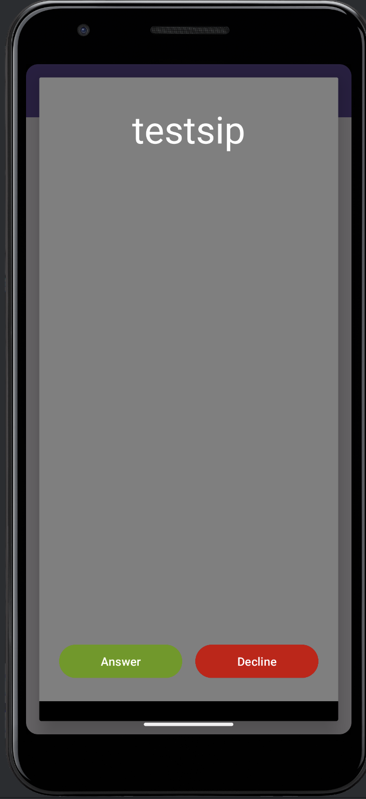

# Talkmore Android

An implementation of android with the integration of [Linphone SDK](https://download.linphone.org/releases/docs/liblinphone/latest/java/). 
The app allows you to make and receive calls from users registered in the talkmore database

## Features of Talkmore

- Login and Register functionality
- Inbound and Outbound feature for users registered
- Filter through registered users and make a call

## Getting started

- Clone repository 
- Change backend services in folder `network\ApiService`
  - You might want to create your own backend services for login and register API

## Screenshots
   